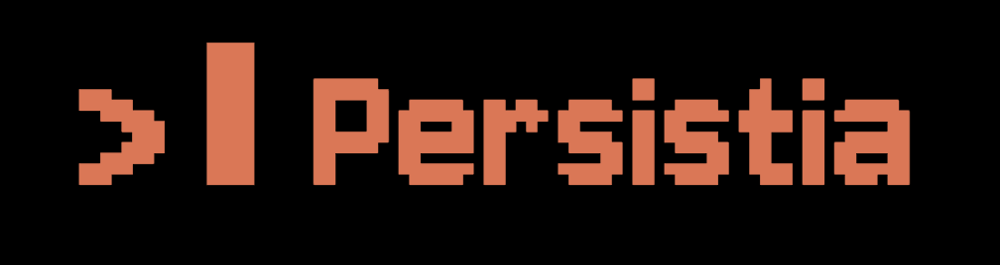

<div align="center">



**Persistia**

# Self-updating persistent memory for Claude Code.

Turn Claude Code into an agent that acts and works seamlessly even as your project evolves.

[](LICENSE)
[](https://claude.ai/code)

</div>

---

Claude Code has no operational memory. Every session starts from zero — you re-explain your stack, paste context, repeat yourself.

**Persistia fixes that.** A `_brain/` folder lives in your project root, storing everything: project knowledge, skills, scheduled tasks, and every instruction you give it. It reads your project once, then self-updates daily from `git diff`. Only what changed, nothing more.

---

## Install

Open Claude Code in your **project root folder**, then run:

```bash
curl -fsSL https://raw.githubusercontent.com/bernardohcrocha/persistia-for-claude-code/main/setup.sh | bash
```

Claude scans your project and asks only what it can't find. No forms. No config files. Just a conversation.

> **Requires:** git · Node.js 18+

> **Optional:** [GitHub CLI](https://cli.github.com) (`gh`) — automatically creates a private brain repository with cloud backup on every update. Format your machine, `git clone` the brain repo, continue exactly where you left off.

> **Scheduler included:** installs automatically (launchd on macOS, systemd on Linux).

---

## How it works

- **Self-updating memory** — runs `git diff` daily. 1,000 files, 3 changed: it reads 3. Token-efficient by design.
- **Permanent skills** — say it once → written to `_brain/skills/`, loaded at every future session
- **Autonomous tasks** — schedule any task in plain language, runs automatically with full context
- **Proactive scan** — every 3 days when idle, it scans metrics, customers, and channels and flags what it notices. Always suggests, never acts unilaterally.
- **Live dashboard** — open `_brain/dashboard.html`, auto-refreshes every 5 min
- **Shareable memory** — its own private git repo. Format your machine, `git clone` the brain repo, continue exactly where you left off. Shareable with your team.

Unlike Hermes Agent, Agent Zero, or OpenClaw — context updates itself. No manual maintenance required.

---

## Tasks you can schedule

→ *"Which customers dropped usage 30%+ this month? Cross-check their support history and draft a personalized re-engagement message for each."*

→ *"Every Monday: pull last week's numbers from Stripe, flag anomalies, and queue a follow-up for any account that dropped below quota."*

→ *"Find signups from the last 30 days with no activity. Visit each company's website and write a personalized email — leading with the most relevant pain points."*

---

## Structure

```
_brain/
├── .git/             ← isolated brain repository, pushes to private GitHub remote
├── index.md          ← agent reads this first, every session
├── dashboard.html    ← live command center, auto-refreshes in browser
├── core/             ← product, brand, ICP
├── operations/       ← metrics + customers, auto-updated daily
├── skills/           ← permanent rules, created and updated automatically
└── tasks/            ← scheduled tasks queue, managed automatically
```

→ [How the git architecture works](ARCHITECTURE.md)

---

No subscriptions. 100% free. 100% open source.

*Claude Code is a product of Anthropic. Persistia is an independent open-source project, not affiliated with or endorsed by Anthropic.*

MIT License · 2026
