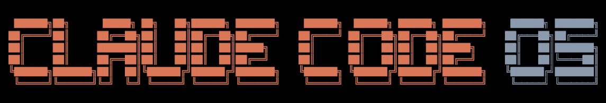

<div align="center">



# Claude Code OS

**Operational Co-Pilot for Solo Founders**

Self-improving · No new tools · No server · No lock-in

[](LICENSE)
[](https://claude.ai/code)

</div>

---

## Why Claude Code OS?

Other agent tools are powerful but passive — you figure out the use cases, connect the tools, write the prompts. Claude Code OS reads your existing project, understands your business, and **proactively suggests what it can do for you**. Every instruction you give is saved as a **self-improving skill**, applied automatically in every future session. It gets smarter the more you use it — with zero new infrastructure, zero new tools, and zero re-explaining.

---

## Quick Start

Open Claude Code in your project and paste:

```
Help me implement Claude Code OS: https://github.com/bernardohcrocha/claude-code-os
```

The agent fetches the framework and starts the setup interview automatically — reading what you already have, asking only what's missing.

---

## Example Use Cases

**Ask anything about your business**
> *"How's my MRR this month vs last?"*  
> *"Which accounts are at risk right now?"*  
> *"Who signed up today — any look like fraud?"*

**Give operational orders**
> *"Follow up with users who haven't made a second query in 7 days"*  
> *"Every Monday, send me a report of new signups and at-risk accounts"*

**Teach it your way of working**
> *"From now on, always mention LGPD when writing to accounting firms"*  
> *"Never group emails by domain — send one per person"*

These become **permanent skills** — applied automatically in every future session, without reminders.

---

## What it does

| | |
|---|---|
| **Uses everything you already have** | Reads your codebase, docs, and `.env` files. Your Stripe key is already there — no reconnecting. Your product logic is in the code — no re-explaining. Minimum effort to get started. |
| **Self-improving skills** | Every instruction becomes a permanent rule, applied forever. One correction, done. Never repeat yourself. |
| **Proactive setup** | Reads your entire project, detects your tools, and **suggests use cases for your specific business** — you don't have to figure out what to ask for. |
| **Process documentation** | No SOPs written yet? It interviews you and **writes the documentation for you** — then keeps it updated automatically. |
| **Live business metrics** | Connects to Stripe, Supabase, or any database already in your project. Revenue, customers, and usage **auto-update daily**. |
| **Operational orders** | Send emails, query databases, generate reports, schedule recurring tasks — all in **plain language**, no code. |

---

## Setup — low effort. It guides you.

Just drop what you have. The agent reads everything, asks only what's missing, and guides you through the rest.

- **Drop your documents and files** into `_brain/inbox/` — SOPs, brand guides, price tables, contracts, code, configs. Reads everything, extracts what matters, archives the originals. Large codebases processed in stages.
- **Zero-friction connections** — your `.env` already has Stripe, Supabase, and other keys. Used directly, no reconnecting.
- **Asks only what's missing** — one question at a time, in plain language.
- **Suggests use cases** — based on what it found in your actual project, not generic templates.
- **Writes missing documentation** — *"I didn't find any SOPs — want me to document your onboarding process?"*
- **Builds a live dashboard** — your north star metrics, auto-refreshing in the browser.

After that, **the brain runs itself.**

---

## Structure

```
_brain/
├── index.html        ← agent reads this first, every session
├── dashboard.html    ← live metrics, auto-refreshes in browser
├── core/             ← product, brand, ICP
├── operations/       ← metrics + customers, auto-updated via cron
├── skills/           ← self-improving rules, evolve from every instruction
├── inbox/            ← drop any documents or files here anytime
└── archive/          ← processed files, kept for reference
```

---

## Philosophy

| | |
|---|---|
| **Single source of truth** | All company knowledge in one place — queryable, actionable, always up to date. |
| **Uses what you have** | Reads your existing project, code, and tools. Minimum effort to get started, minimum effort to keep going. |
| **Self-improving** | Skills evolve from your instructions. Every correction makes it permanently smarter. No retraining, no config — just talk. |
| **Proactive, not passive** | Reads your business, suggests actions, documents processes — doesn't wait to be asked. |
| **Local files** | No server, no database. Everything lives in your project — portable, versionable, fully owned. |

---

> **Tip:** Pair with [handy.computer](https://handy.computer) or WhisperFlow to talk to your company by voice — give orders between meetings, ask about revenue while commuting. Your virtual employee, always available.

---

*Claude Code is a product of Anthropic. Claude Code OS is an independent open-source project, not affiliated with or endorsed by Anthropic.*  
MIT License · 2026
